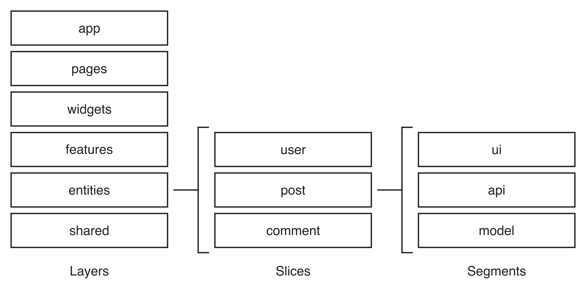

# React.js + Nest.js + MongoBD

## Project overview
-Placeholder-

## How to start
Initially, project is build on `Node` version `22.5.1` and `Yarn` version `4.0.0-rc.45`.
To install all necessary dependencies just run:
```bash
yarn install
```

## Backend
The backend is developed using NestJS, following best practices and patterns recommended in the official [NestJS documentation](https://docs.nestjs.com). This ensures a modular and maintainable structure for scalable applications.

The application runs by default on port `8080`, but this can be modified according to your needs by configuring the environment variables.

Environment Variables
Environment-specific settings are managed using `.env` files. All crucial configuration values such as database credentials, API keys, and other sensitive information should be defined within the `.env` file located at the root of the project. The default environment is considered to be the development environment.

For more specific environments like staging or production, separate configuration files such as `.env.staging` or `.env.production` should be created and utilized. This helps in cleanly separating environment configurations and ensuring that sensitive production variables are not mixed with development configurations. The backend uses MongoDB as the primary database, document-oriented database known for its scalability and flexibility.

Additionally, make sure that these environment files are appropriately handled and excluded from version control by adding them to your `.gitignore` file, thus preventing sensitive data from being exposed in the repository.

## Frontend
The frontend is developed using `React` with `TypeScript`, providing a strong foundation for building maintainable and scalable applications. To enhance the development experience, Vite is used as the build tool, offering fast bundling and hot module replacement (HMR) for seamless development workflows.

For the user interface, we are utilizing [Chakra UI](https://v2.chakra-ui.com/docs/components), a modern and accessible component library for React. `Chakra UI` offers a comprehensive collection of customizable and responsive components that help developers create beautiful, consistent, and functional user interfaces with ease.

The project is structured following the [Feature-Sliced Design (FSD) methodology](https://feature-sliced.design/docs/get-started/overview). This architectural pattern is focused on dividing the codebase by features, ensuring that each feature remains independent and modular. FSD promotes better scalability, separation of concerns, and maintainability as the application grows.
<picture>
  <source srcset="assets/fsd/dark.png" media="(prefers-color-scheme: dark)">
  <source srcset="assets/fsd/light.png" media="(prefers-color-scheme: light)">
  
</picture>

The frontend is pre-configured with [Vite](https://vite.dev) default setup, enabling fast builds and minimal configuration. The project structure is optimized for maintainability and growth, aligning with the principles of FSD to ensure a well-organized and scalable application.